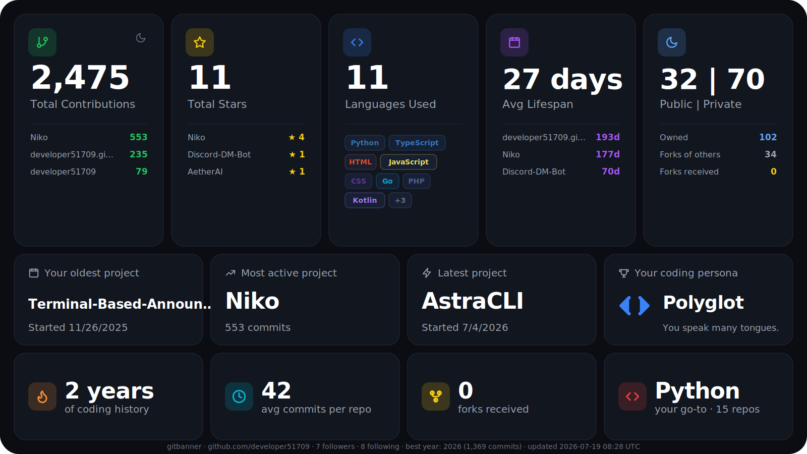

  

---

<h1 align="center">Soren</h1>

<strong>Developer • Automation Builder • Discord Bot Engineer</strong>

  <a href="https://soren.is-a.dev">🌐 Website</a> •
  <a href="mailto:developer51709@proton.me">📧 Email</a> •
  <a href="https://github.com/developer51709?tab=followers">⭐ Follow</a> •
  <a href="https://github.com/developer51709/developer51709/tree/d4aac28a12da5eb7afdb61b256d5674d24783e23/public_keys">🔐 Public Keys</a>

---

## 👨‍💻 About Me
I'm a young developer focused on building automation tools, Discord bots, and lightweight utilities. I enjoy solving problems with code, experimenting with APIs, and creating systems that run reliably on their own.

- 🔧 Currently building: **Discord bots & automation pipelines**
- 📚 Learning: **AI Automation Integrations**
- 🤝 Open to: **Coding requests, collaborations, and small freelance tasks**

---

## 🧰 Tech Stack

  

---

## 📂 Featured Projects

| Project | Description |
|--------|-------------|
| **[Niko](https://github.com/developer51709/Niko)** | Niko is a easy to use ai chatbot for discord that includes many different features and commands as well as a modular cog system and regular updates. |
| **[Terminal Announcement Bot](https://github.com/developer51709/Terminal-Based-Announcement-Bot-For-Discord)** | CLI tool for sending announcements to Discord servers. |
| **[Discord DM Bot](https://github.com/developer51709/Discord-DM-Bot)** | Automates sending DMs to server members with customizable settings. |
| **[HelixDB](https://github.com/developer51709/HelixDB)** | A lightweight, local‑first database engine built for modern applications — corruption‑resistant, high‑performance, and designed for both development and production. Includes built‑in backups, recovery, and a simple HTTP/JSON API for Node.js and Python. |

---

## 📊 GitHub Analytics

  
  
  

---

## 📬 Coding Requests
I’m currently accepting coding requests for Discord bots, automation tools, and small utilities.

📧 **Email:** developer51709@proton.me
💬 **Discord:** sorenthedev

---

